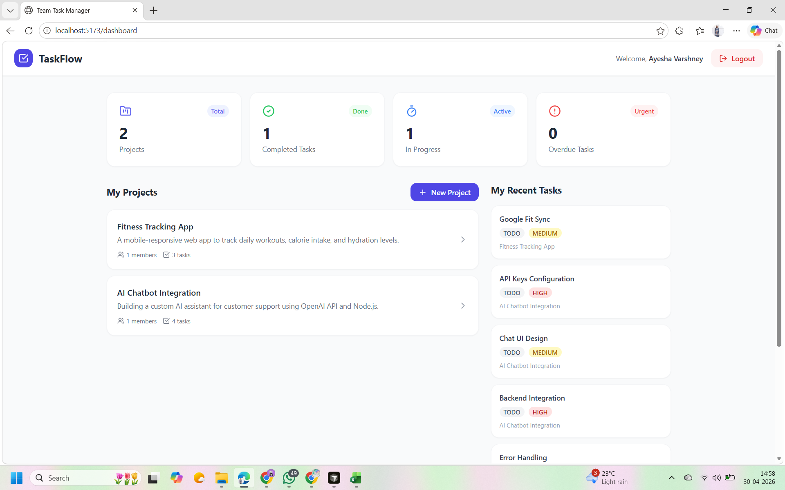
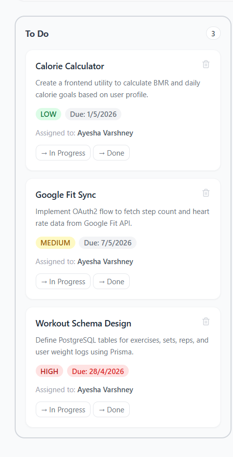
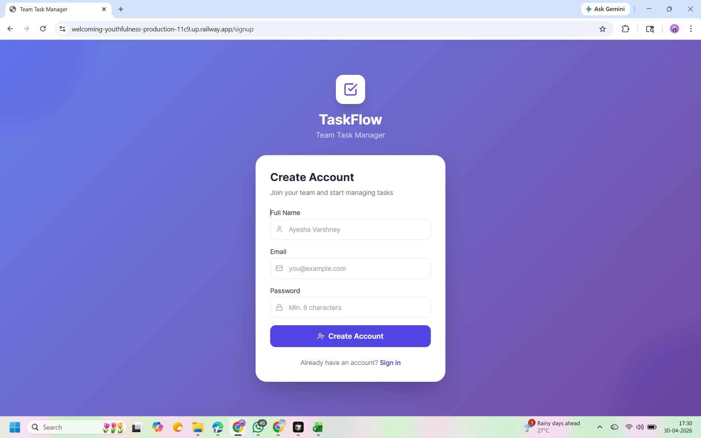

# TaskFlow — Team Task Manager

A full-stack web application for managing team projects and tasks with role-based access control.

## Tech Stack

**Frontend:** React 18, Vite, Tailwind CSS, React Router v6, Axios, Lucide Icons  
**Backend:** Node.js, Express, Prisma ORM  
**Database:** PostgreSQL (Railway)  
**Deployment:** Railway

---

## Project Structure

```
team-task-manager/
├── backend/
│   ├── prisma/schema.prisma     # Database schema
│   ├── src/
│   │   ├── controllers/         # Business logic
│   │   ├── middleware/          # JWT auth, role checks
│   │   ├── routes/              # API route definitions
│   │   └── index.js             # Express entry point
│   └── package.json
├── frontend/
│   ├── src/
│   │   ├── context/AuthContext.jsx
│   │   ├── pages/
│   │   │   ├── Login.jsx
│   │   │   ├── Signup.jsx
│   │   │   ├── Dashboard.jsx
│   │   │   ├── CreateProject.jsx
│   │   │   └── ProjectDetail.jsx
│   │   └── App.jsx
│   └── package.json
└── README.md
```

---

## Local Setup

### Prerequisites
- Node.js v18+
- Git

### 1. Clone the repo
```bash
git clone <your-repo-url>
cd team-task-manager
```

### 2. Backend Setup
```bash
cd backend
npm install
```

Create `backend/.env`:
```
DATABASE_URL="your_postgresql_url"
JWT_SECRET="your_secret_key"
PORT=5000
FRONTEND_URL=http://localhost:5173
```

Push database schema and start:
```bash
npx prisma generate
npx prisma db push
npm run dev
```

Backend runs on: `http://localhost:5000`

### 3. Frontend Setup
```bash
cd ../frontend
npm install
```

Create `frontend/.env`:
```
VITE_API_URL=http://localhost:5000/api
```

Start dev server:
```bash
npm run dev
```

Frontend runs on: `http://localhost:5173`

---

## API Endpoints

| Method | Endpoint | Description | Auth |
|--------|----------|-------------|------|
| POST | /api/auth/register | Signup | No |
| POST | /api/auth/login | Login | No |
| GET | /api/auth/me | Get current user | Yes |
| GET | /api/projects | List my projects | Yes |
| POST | /api/projects | Create project | Yes |
| GET | /api/projects/:id | Get project details | Yes |
| DELETE | /api/projects/:id | Delete project | Admin |
| POST | /api/projects/:id/members | Add member | Admin |
| DELETE | /api/projects/:id/members/:userId | Remove member | Admin |
| POST | /api/projects/:id/tasks | Create task | Admin |
| PATCH | /api/projects/:id/tasks/:taskId | Update task | Admin/Assignee |
| DELETE | /api/projects/:id/tasks/:taskId | Delete task | Admin |
| GET | /api/dashboard | Dashboard stats | Yes |

---

## Railway Deployment

### Step 1: Push to GitHub
```bash
git init
git add .
git commit -m "Initial commit"
git branch -M main
git remote add origin <your-github-repo-url>
git push -u origin main
```

### Step 2: Deploy Backend on Railway
1. Go to [railway.app](https://railway.app) → New Project
2. "Deploy from GitHub repo" → select your repo
3. Select `backend` folder as root
4. Add environment variables:
   - `DATABASE_URL` → copy from Railway PostgreSQL plugin
   - `JWT_SECRET` → any random string
   - `FRONTEND_URL` → your frontend Railway URL (set after frontend deploy)
5. Railway will auto-run: `npx prisma generate && npx prisma db push && node src/index.js`

### Step 3: Add PostgreSQL Plugin
In your Railway project → Add Plugin → PostgreSQL  
Copy the `DATABASE_URL` and set it in backend env vars.

### Step 4: Deploy Frontend on Railway
1. Add another service → same GitHub repo
2. Select `frontend` folder as root
3. Add environment variable:
   - `VITE_API_URL` → your backend Railway URL + `/api`
4. Build command: `npm install && npm run build`
5. Start command: `npm run preview -- --host 0.0.0.0 --port $PORT`

---

## 🖼️ Application Previews

### 1. Dashboard Overview

*Real-time statistics of projects and tasks.*

### 2. Kanban Board (Project Management)

*Manage tasks across To-Do, In-Progress, and Done columns.*

### 3. User Authentication

*Secure JWT-based registration.*

---

## Features

- **User Auth:** Signup, Login with JWT tokens
- **Projects:** Create projects, you become Admin automatically
- **Team Management:** Admin can add/remove members by email
- **Task Management (Kanban):** To Do → In Progress → Done
- **Role-Based Access:**
  - Admin: full CRUD on tasks, members, projects
  - Member: can only update status of tasks assigned to them
- **Dashboard:** Live stats — project count, task status breakdown, overdue tasks, my tasks

---

*Built for Ethara AI Full-Stack Assignment*
